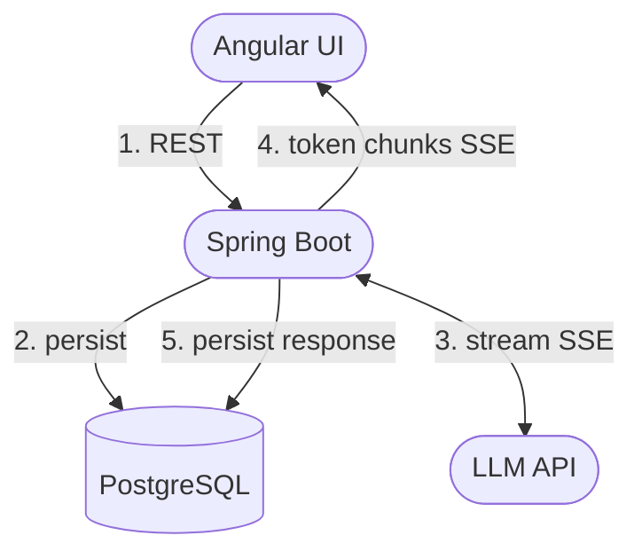

### Sherlock Architecture

```mermaid
graph TB
    UI(["Angular UI"])
    BE(["Spring Boot"])
    DB[("PostgreSQL")]
    LLM(["LLM API"])

    UI -->|"1. REST"| BE
    BE -->|"2. persist"| DB
    BE <-->|"3. stream SSE"| LLM
    BE -->|"4. token chunks SSE"| UI
    BE -->|"5. persist response"| DB
```
