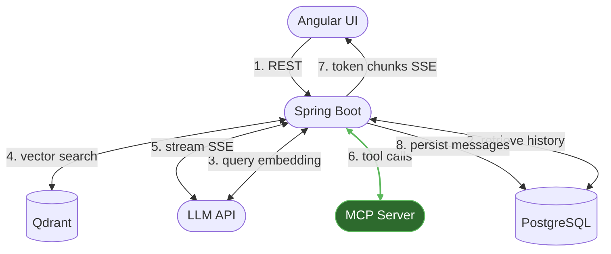

### Sherlock Architecture — with MCP

```mermaid
graph TB
    UI(["Angular UI"])
    BE(["Spring Boot"])
    DB[("PostgreSQL")]
    LLM(["LLM API"])
    QD[("Qdrant")]
    MCP(["MCP Server"]):::new

    UI -->|"1. REST"| BE
    DB <-->|"2. retrieve history"| BE
    LLM <-->|"3. query embedding"| BE
    BE <--> |"4. vector search"| QD
    BE <-->|"5. stream SSE"| LLM
    BE <-->|"6. tool calls"| MCP
    BE -->|"7. token chunks SSE"| UI
    BE -->|"8. persist messages"| DB

    classDef new fill:#2d6a2d,stroke:#5cb85c,color:#fff
    linkStyle 5 stroke:#5cb85c,stroke-width:2px
```
