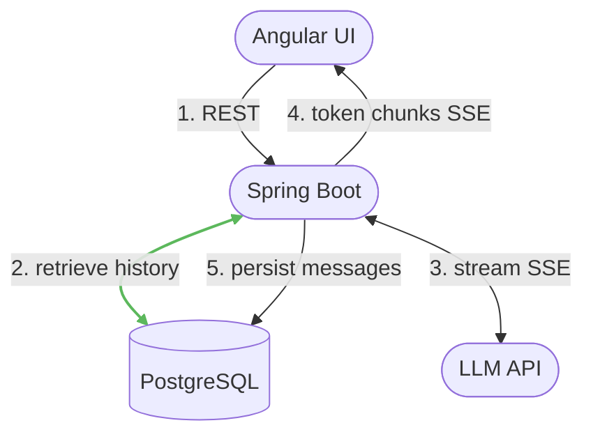

### Sherlock Architecture — with Memory

```mermaid
graph TB
    UI(["Angular UI"])
    BE(["Spring Boot"])
    DB[("PostgreSQL")]
    LLM(["LLM API"])

    UI -->|"1. REST"| BE
    BE <-->|"2. retrieve history"| DB
    BE <-->|"3. stream SSE"| LLM
    BE -->|"4. token chunks SSE"| UI
    BE -->|"5. persist messages"| DB

    linkStyle 1 stroke:#5cb85c,stroke-width:2px
```
