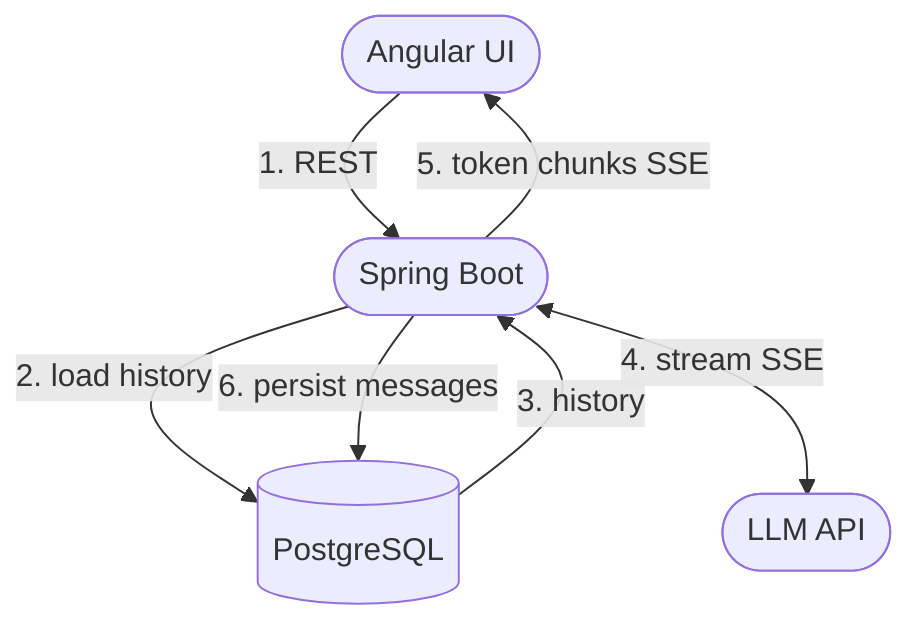

### Sherlock Architecture — with Memory

```mermaid
graph TB
    UI(["Angular UI"])
    BE(["Spring Boot"])
    DB[("PostgreSQL")]
    LLM(["LLM API"])

    UI -->|"1. REST"| BE
    BE -->|"2. load history"| DB
    DB -->|"3. history"| BE
    BE <-->|"4. stream SSE"| LLM
    BE -->|"5. token chunks SSE"| UI
    BE -->|"6. persist messages"| DB
```
