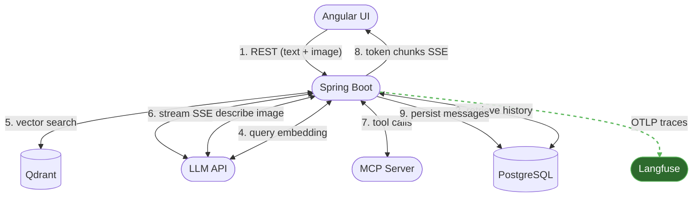

### Sherlock Architecture — Observability with Langfuse

```mermaid
graph TB
    UI(["Angular UI"])
    BE(["Spring Boot"])
    DB[("PostgreSQL")]
    LLM(["LLM API"])
    QD[("Qdrant")]
    MCP(["MCP Server"])
    LF(["Langfuse"]):::new

    UI -->|"1. REST (text + image)"| BE
    DB <-->|"2. retrieve history"| BE
    LLM <-->|"3. describe image"| BE
    LLM <-->|"4. query embedding"| BE
    BE <--> |"5. vector search"| QD
    BE <-->|"6. stream SSE"| LLM
    BE <-->|"7. tool calls"| MCP
    BE -->|"8. token chunks SSE"| UI
    BE -->|"9. persist messages"| DB

    BE -.->|"OTLP traces"| LF:::new

    classDef new fill:#2d6a2d,stroke:#5cb85c,color:#fff
    linkStyle 9 stroke:#5cb85c,stroke-width:2px,stroke-dasharray:5
```
